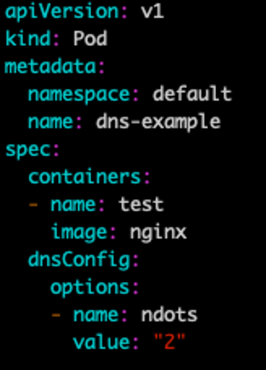
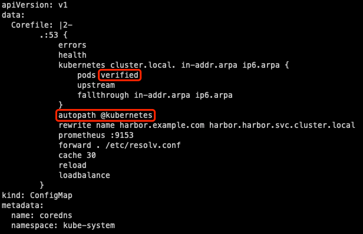

## 概述

CoreDNS 作为 Kubernetes 集群的域名解析组件，如果性能不够可能会影响业务，本文介绍几种 CoreDNS 的性能优化手段。

## 合理控制 CoreDNS 副本数

考虑以下几种方式:
1. 根据集群规模预估 coredns 需要的副本数，直接调整 coredns deployment 的副本数:
```bash
kubectl -n kube-system scale --replicas=10 deployment/coredns
```
2. 为 coredns 定义 HPA 自动扩缩容。
3. 安装 [cluster-proportional-autoscaler](https://github.com/kubernetes-sigs/cluster-proportional-autoscaler) 以实现更精确的扩缩容(推荐)。

## 优化 ndots

默认情况下，Kubernetes 集群中的域名解析往往需要经过多次请求才能解析到。查看 pod 内 的 `/etc/resolv.conf` 可以知道 `ndots` 选项默认为 5:


意思是: 如果域名中 `.` 的数量小于 5，就依次遍历 `search` 中的后缀并拼接上进行 DNS 查询。

举个例子，在 debug 命名空间查询 `kubernetes.default.svc.cluster.local` 这个 service:
1. 域名中有 4 个 `.`，小于 5，尝试拼接上第一个 search 进行查询，即 `kubernetes.default.svc.cluster.local.debug.svc.cluster.local`，查不到该域名。
2. 继续尝试 `kubernetes.default.svc.cluster.local.svc.cluster.local`，查不到该域名。
3. 继续尝试 `kubernetes.default.svc.cluster.local.cluster.local`，仍然查不到该域名。
4. 尝试不加后缀，即 `kubernetes.default.svc.cluster.local`，查询成功，返回响应的 ClusterIP。

可以看到一个简单的 service 域名解析需要经过 4 轮解析才能成功，集群中充斥着大量无用的 DNS 请求。

怎么办呢？我们可以设置较小的 ndots，在 Pod 的 dnsConfig 中可以设置:



然后业务发请求时尽量将 service 域名拼完整，这样就不会经过 search 拼接造成大量多余的 DNS 请求。

不过这样会比较麻烦，有没有更好的办法呢？有的！请看下面的 autopath 方式。

## 启用 autopath

启用 CoreDNS 的 autopath 插件可以避免每次域名解析经过多次请求才能解析到，原理是 CoreDNS 智能识别拼接过 search 的 DNS 解析，直接响应 CNAME 并附上相应的 ClusterIP，一步到位，可以极大减少集群内 DNS 请求数量。

启用方法是修改 CoreDNS 配置:

```bash
kubectl -n kube-system edit configmap coredns
```

修改红框中圈出来的配置:



* 加上 `autopath @kubernetes`。
* 默认的 `pods insecure` 改成 `pods verified`。

需要注意的是，启用 autopath 后，由于 coredns 需要 watch 所有的 pod，会增加 coredns 的内存消耗，根据情况适当调节 coredns 的 memory request 和 limit。


## 部署 NodeLocal DNSCache

参考 k8s 官方文档 [Using NodeLocal DNSCache in Kubernetes clusters](https://kubernetes.io/docs/tasks/administer-cluster/nodelocaldns/)