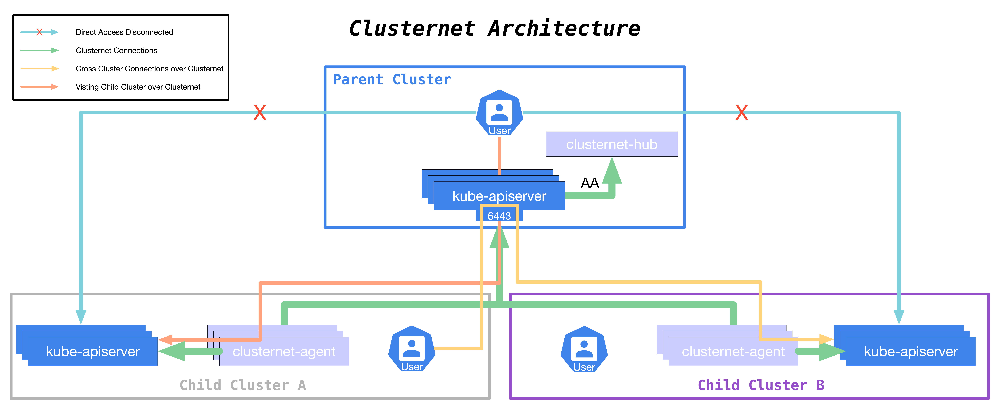

## 概述

本文记录 [clusternet](https://github.com/clusternet/clusternet) 的安装方法。

## Clusternet 架构



clusternet 架构比较简单，控制面是 `clusternet-hub`，安装在父集群中，然后 `clusternet-agent` 安装在子集群中，通过操作父集群配置来控制多集群部署。

## 添加 helm repo

推荐使用 helm 部署 clusternet， 添加 clusternet 的 helm repo:

```bash
helm repo add clusternet https://clusternet.github.io/charts
```

可以看到 repo 中包含 `clusternet-agent` 和 `clusternet-hub` 两个 chart 包:

```bash
$ helm search repo clusternet
NAME                       	CHART VERSION	APP VERSION	DESCRIPTION
clusternet/clusternet-agent	0.2.1        	v0.6.0     	Chart for clusternet-agent
clusternet/clusternet-hub  	0.2.1        	v0.6.0     	Chart for clusternet-hub
```

## 安装 clusternet-hub

首先准备好父集群，切换 kubeconfig 的 context 到父集群，然后准备下 `clusternet-hub` 的安装配置，建议先导出所需完整配置:

```bash
helm show values clusternet/clusternet-hub > clusternet-hub-values.yaml
```

如果有需要自定义的配置可以自行改下，然后进行安装:

```bash
helm upgrade --install clusternet-hub -n clusternet-system --create-namespace -f clusternet-hub-values.yaml clusternet/clusternet-hub
```
  > 若后续要卸载，可执行 `helm uninstall clusternet-hub -n clusternet-system`
  
准备 `bootstrap-token-secret.yaml`:

```yaml
apiVersion: v1
kind: Secret
metadata:
  # Name MUST be of form "bootstrap-token-<token id>"
  name: bootstrap-token-07401b
  namespace: kube-system

# Type MUST be 'bootstrap.kubernetes.io/token'
type: bootstrap.kubernetes.io/token
stringData:
  # Human readable description. Optional.
  description: "The bootstrap token used by clusternet cluster registration."

  # Token ID and secret. Required.
  token-id: 07401b
  token-secret: f395accd246ae52d

  # Expiration. Optional.
  expiration: 2025-05-10T03:22:11Z

  # Allowed usages.
  usage-bootstrap-authentication: "true"
  usage-bootstrap-signing: "true"

  # Extra groups to authenticate the token as. Must start with "system:bootstrappers:"
  auth-extra-groups: system:bootstrappers:clusternet:register-cluster-token
```

* `token-secret` 可以通过 `head -c 32 /dev/random | md5sum |cut -c 1-16` 来生成替换。

apply 到集群中去:

```bash
kubectl apply -f bootstrap-token-secret.yaml
```

## 安装 clusternet-agent

切换 kubeconfig 的 context 到子集群，然后准备下 `clusternet-agent` 的安装配置，建议先导出所需完整配置:

```bash
helm show values clusternet/clusternet-agent > clusternet-agent-values.yaml
```

安装 clusternet-agent 时建议自定义一下要注册上去的集群名称，填写有意义的字符串作为集群名称(默认是自动生成一串无意义的字符)，方便后续部署分发应用时有较好的可读性，也利于集群管理。

自定义的方式是修改配置，`extraArgs` 里定义一下 `cluster-reg-name` 参数，例如:

```yaml
extraArgs:
  cluster-reg-name: 'bj-prod'
```

> 更多自定义参数可自行参考 `clusternet-agent` 的 `--help`。

最后进行安装:

```bash
helm upgrade --install clusternet-agent -n clusternet-system --create-namespace -f clusternet-agent-values.yaml clusternet/clusternet-agent
```
  > 若后续要卸载，可执行 `helm uninstall clusternet-agent -n clusternet-system`

## 检查集群注册情况

clusternet-agent 安装好后，如果没有差错，会自动将当前子集群注册到父集群，可以将 context 切到父集群中检查下注册情况:

```bash
$ # clsrr is an alias for ClusterRegistrationRequest
$ kubectl get clsrr
NAME                                              CLUSTER ID                             STATUS     AGE
clusternet-6c085c18-3baf-443c-abff-459751f5e3d3   6c085c18-3baf-443c-abff-459751f5e3d3   Approved   2m2s
```

正常情况下 `ClusterRegistrationRequest` 状态为 `Approved`。

不出意外，查看下 `ManagedCluster` 列表，可以看到子集群已经注册上去了:

```bash
# mcls is an alias for ManagedCluster
$ kubectl get mcls -o wide -A
NAMESPACE          NAME                       CLUSTER ID                             CLUSTER TYPE   SYNC MODE   KUBERNETES       READYZ   AGE
clusternet-ml6wg   clusternet-cluster-rjnxh   6c085c18-3baf-443c-abff-459751f5e3d3   EdgeCluster    Dual        v1.18.4-tke.16   true     9m25s
```

## 安装 kubectl-clusternet

我们还可以安装下 clusternet 的 kubectl 插件，方便跟 clusternet 交互:

```bash
$ kubectl krew update
$ kubectl krew install clusternet
# check plugin version
$ kubectl clusternet version
```

> 前提是已安装了 [Krew](https://github.com/kubernetes-sigs/krew) (kubectl 包管理器)，若没安装，可以参考 [这里](https://krew.sigs.k8s.io/docs/user-guide/setup/install/)。