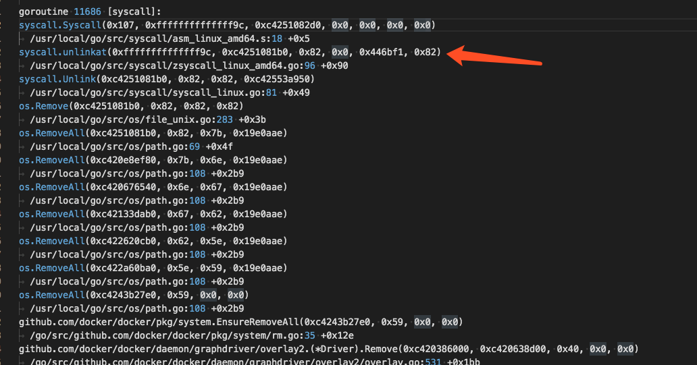
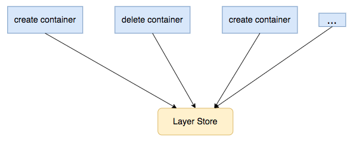

> 本文投稿原文来自 https://cloud.tencent.com/developer/article/1809257

## 问题背景

在创建 TKE 集群的 worker node 时，用户往往会单独再购买一块云盘，绑到节点上，用于 docker 目录挂载所用（将 docker 目录单独放到数据盘上）。此时，docker 的读写层（RWLayer）就会落到云盘上。

在该使用场景下，有用户反馈，在创建 Pod 时，会偶现 Pod 创建超时的报错，具体报错如下：


## 结论先行

当单独挂载一块云盘用于 docker 目录挂载使用时，会出现如下情况：云盘的真实使用超过云盘所支持的最大吞吐，导致 pod 创建超时。

## pod 失败的异常事件

从报错的事件上来看，可以看到报错是 create sandbox 时，rpc 调用超时了。

在 create sandbox 时，dockershim 会发起两次dockerd调用，分别是：`POST /containers/create` 和 `POST /containers/start`。而事件上给出的报错，就是 `POST /containers/create` 时的报错。

## 日志和堆栈分析

开启dockerd的debug模式后，在异常报错时间段内，能够看到有与 `POST /containers/create` 相关的日志，但是并没有看到与 `POST /containers/start` 相关的日志，说明 docker daemon 有收到 create container 的 rpc 请求，但是并没有在timeout的时间内，完成请求。可以对应到 pod 的异常报错事件。

当稳定复现问题（rpc timeout）之后，手动尝试在节点上通过curl命令，向docker daemon请求create containber。

命令如下：

```bash
$ curl --unix-socket /var/run/docker.sock "http://1.38/containers/create?name=test01" -v -X POST -H "Content-Type: application/json" -d '{"Image": "nginx:latest"}'
```

当执行 curl 命令之后，确实要等很长时间（>2min）才返回。

并抓取 dockerd 的堆栈信息，发现如下：**在问题发生时，有一个 delete container 动作，长时间卡在了 unlinkat 系统调用。**



container 的 create 和 delete 请求都会沉浸到 layer store组件，来创建或者删除容器的读写层。

在 layer store 组件中，维护了一个内部数据结构（layerStore），其中有一个字段 `mounts map[string]*mountedLayer` 用于维护所有容器的读写层信息，并且还配置了一个读写锁用于保护该信息（数据mounts的任何增删操作都需要先获取一个读写锁）。如果某个请求（比如container delete）长时间没有返回，就会阻塞其他 container 的创建或者删除。



## 云盘监控

云盘的相关监控可以重点关注以下三个指标：云盘写流量、IO await、IO %util。

## 解决方案

配合业务场景需求，更换更高性能的云盘。

腾讯云上的云硬盘种类和吞吐指标可以 [官方参考文档](https://cloud.tencent.com/document/product/362/2353) 。